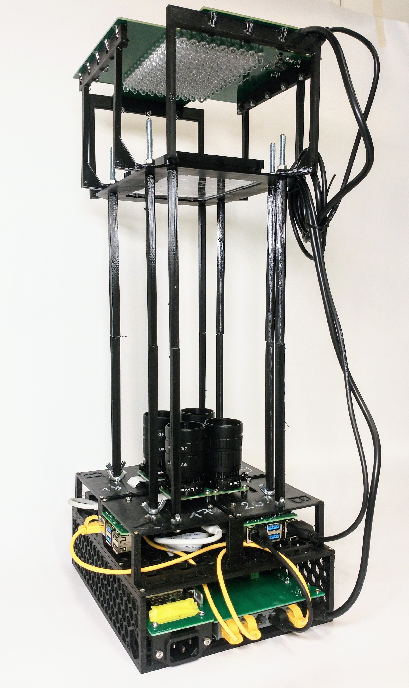

# Wormstation

A fully open-source, all-in-one platform designed for **ease of use** and **accessibility**, yet offering **powerful, highly automated** solutions for laboratory-grade biological research. Wormstation is **ideal for high-throughput workflows** and **streamlined experimental processes**, particularly in _C. elegans_ studies and other small model organisms.

---

## Repositories

- **Wormstation Controller**  
  [GitHub: wormstation_controller](https://github.com/mmaatthieuu/wormstation_controller)  
  A user-friendly GUI that remotely controls the Wormstation Client software. It manages camera and LED settings, schedules recordings, and facilitates error checks or updates—all from a single interface.

- **Wormstation Client**  
  [GitHub: wormstation_client](https://github.com/mmaatthieuu/wormstation_client)  
  The client software running on each Wormstation device (e.g., Raspberry Pi). It handles local camera captures, LED strobing or continuous illumination, data compression, and robust logging routines.

---

## Hardware Overview

Below is an example Wormstation hardware setup, illustrating the 3D-printed housing, integrated cameras, LED arrays, and other key components:

The complete mechanical and electronic designs (including 3D-printable files and KiCad schematics) are maintained in this repository, making the project fully open and reproducible.

---

## Key Features

- **High-Throughput**  
  Record multiple worms in parallel with automated capture schedules and minimal user intervention.
- **Fully Open-Source**  
  All code, hardware designs, and documentation are freely available for community-driven improvements.
- **Modular & Extensible**  
  Easily replace or upgrade components, adapt the software for new experimental protocols, or integrate additional sensors/actuators.
- **Optogenetics & Advanced Illumination**  
  Precisely control IR, blue, and orange LEDs for non-disruptive observation or targeted neural stimulation.
- **Comprehensive Logging**  
  Both the controller and the client track system status, events, and errors, aiding reproducibility and troubleshooting.

---

## Getting Started

1. **Hardware Assembly**  
   - Print the parts (`3D_print/` directory) and assemble according to the provided instructions.
   - Populate the PCB using KiCad files and a bill of materials found in the `electronics/` directory.
   - Mount the cameras, LED rings, or other illumination modules as described in the hardware guides.

2. **Software Installation**  
   - Set up the [Wormstation Client](https://github.com/mmaatthieuu/wormstation_client) on each device (e.g., Raspberry Pi).
   - Use the [Wormstation Controller](https://github.com/mmaatthieuu/wormstation_controller) GUI on your PC for centralized management.

3. **Configuration**  
   - Provide network addresses or hostnames in a `hosts.txt` file so the controller can detect each Wormstation on the LAN or VPN.
   - Customize recording schedules, LED parameters, and log verbosity per your research needs.

4. **Run Experiments**  
   - Start the controller application, select the devices, and define the experimental parameters.
   - Monitor live frames or single-shot previews to check focus/illumination.
   - Retrieve data automatically from each device or store on a NAS for uninterrupted long-term runs.

---

## Contributing

We welcome feedback, bug reports, and pull requests from the community. Please see the individual repositories for guidelines or open a GitHub Issue if you encounter any problems.

---

## License

This project is made available under the [MIT License](LICENSE). We encourage the community to adapt and expand Wormstation for diverse research applications.

---

## Contact

For questions, collaborations, or to share results:

- **Primary Maintainer**: [@mmaatthieuu](https://github.com/mmaatthieuu)  
- **Email**: [\<insert email\>](mailto:someone@example.com)

We look forward to hearing how Wormstation can accelerate your research!
